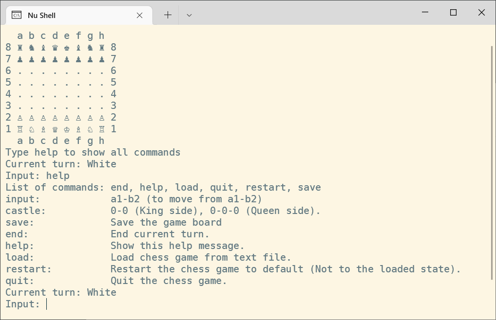

## Chess

This is a simple chess game that can be played on the command line.



### Visuals

```
  a b c d e f g h
8 ♜ ♞ ♝ ♛ ♚ ♝ ♞ ♜ 8
7 ♟ ♟ ♟ ♟ ♟ ♟ ♟ ♟ 7
6 . . . . . . . . 6
5 . . . . . . . . 5
4 . . . . . . . . 4
3 . . . . . . . . 3
2 ♙ ♙ ♙ ♙ ♙ ♙ ♙ ♙ 2
1 ♖ ♘ ♗ ♕ ♔ ♗ ♘ ♖ 1
  a b c d e f g h
```

### Current features

1. Save/Load game to/from text file
2. All pieces movements (Pawns, Rooks, Knights, Bishops, Queens, Kings)
3. Win condition ala Check (When king is captured)
4. Pawn promotion
5. Castling
6. En passant

### Help: Unicode symbols not displaying properly in my Windows Terminal

Firstly, I have only tested this implementation on Windows Terminal with the following settings,
1. Make sure chcp 65001 is run before running the game.
2. Make sure the font supports the unicode characters, I am using Dejavu sans mono, to see if the font supports the symbols on Windows, go to, Start > Character Map, and
select the font used in the Windows Terminal (Note: I am using Windows Terminal with powershell), search for chess under advanced. See below screenshot


### Disclaimer

I am not a chess expert and I just based the rules of chess based on memory as well as what I can find on the internet. Some of the rules may not be correct or implemented. This is just an exercise for me to build a simple chess game with Java.
